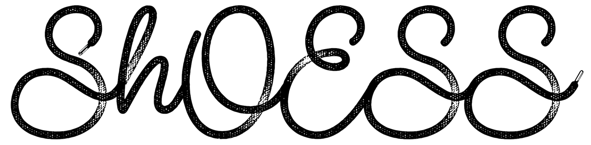

# 

This notebook calculates the sensitivities to the lepton mixing matrix unitarity and to the light sterile neutrino (3+1) model for the Short Oscillations at the European Spallation Source experiment (ShOESS).
